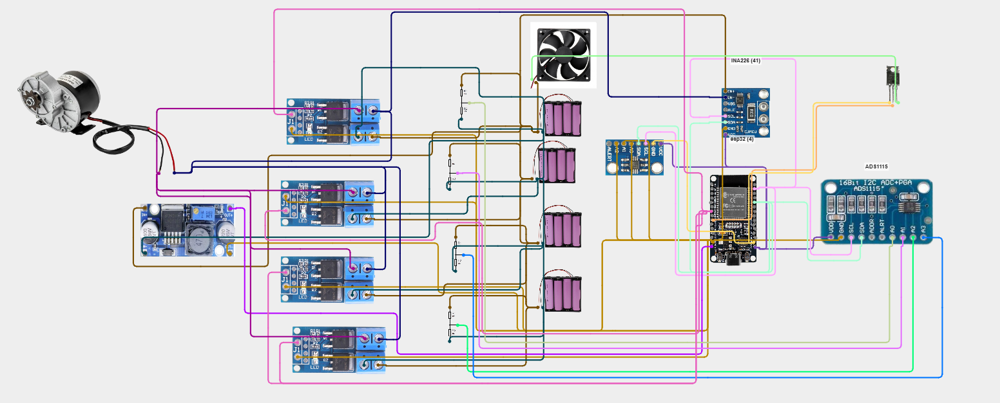
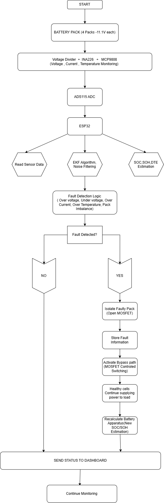
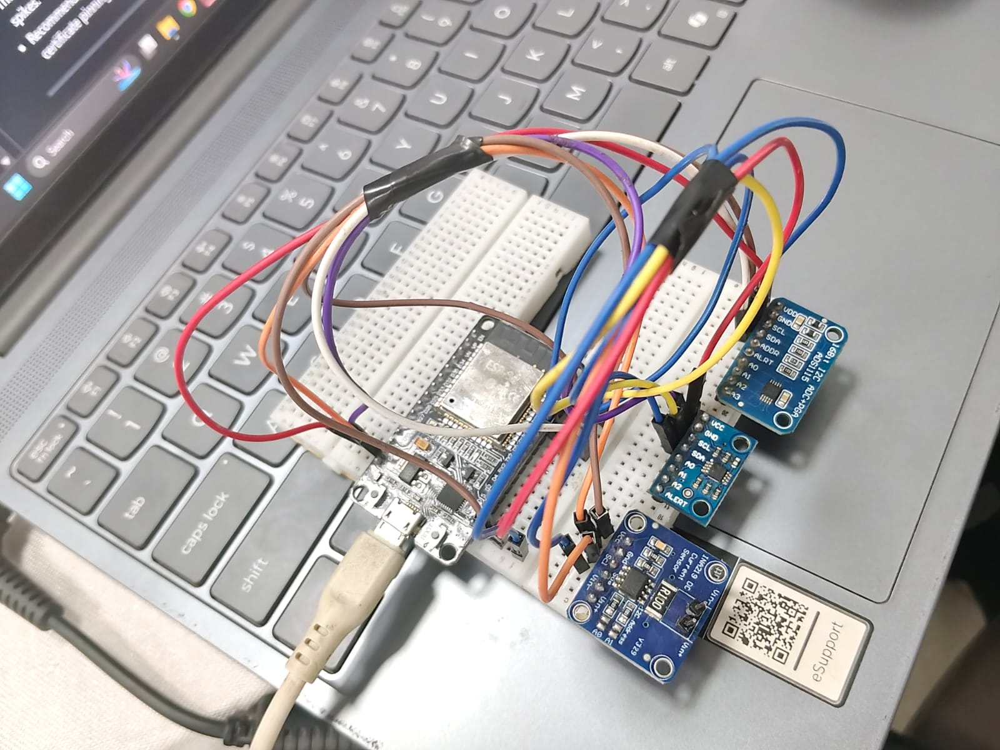
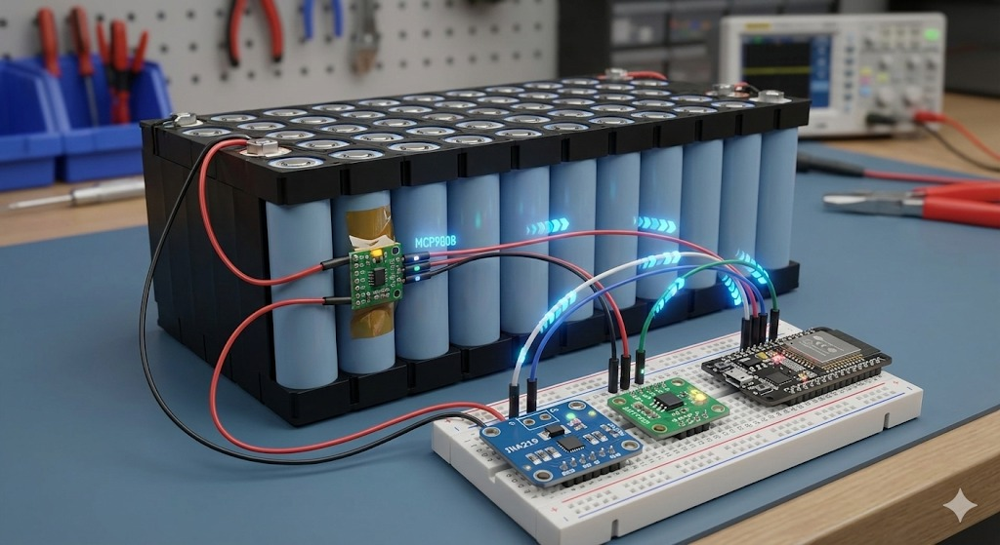

# &#9889; Digital Twin System For EV Vechicles 

A real-time **digital twin** for an electric-vehicle battery pack: an ESP32
reads voltage, current, power and temperature from the physical pack,
computes State of Charge (SOC), State of Health (SOH) and Distance-To-Empty
(DTE), and a web dashboard mirrors those values as an animated, automotive-style
instrument cluster.

**Live demo (frontend):** https://pgsiva.github.io/Digital-twin/

---

## Team

| Name | Role | GitHub |
|------|------|--------|
| NENESH RAJ.T | THINK SPEAK MATLAB| https://github.com/Neneshraj |
| KABILESH.S | COMPONENTS CONNECTION CODING | https://github.com/kabi03093-lgtm |
| JAGAN.C | FRONTEND AND BACKEND DEVELOPMENT | https://github.com/Jagan-lap |
| SIVA KUMAR P.G | FRONTEND AND BACKEND DEVELOPMENT | https://github.com/pgsiva |
| AKILA DEVI.S | Hardware / Circuit Design  | https://github.com/Akilasurendran01 |
| BARKAVI.P | Hardware / Circuit Design  | https://github.com/barkavi075-p |


> Fill in your actual team name, member names, roles and GitHub handles here
> before submission.

---

## Table of contents

1. [Problem statement & solution](#problem-statement--solution)
2. [Features](#features)
3. [Tech stack](#tech-stack)
4. [System architecture](#system-architecture)
5. [Workflow](#workflow)
6. [Folder structure](#folder-structure)
7. [Installation & usage](#installation--usage)
8. [API documentation](#api-documentation)
9. [Hardware, circuit & wiring](#hardware-circuit--wiring)
10. [Security measures](#security-measures)
11. [Testing & performance](#testing--performance)
12. [Challenges faced](#challenges-faced)
13. [Future scope](#future-scope)
14. [Demo](#demo)
15. [References](#references)

---

## Problem statement & solution

**Problem:** EV owners and technicians have no simple way to see a battery
pack's real-time health at a glance. Raw voltage/current numbers on a
multimeter don't translate into decisions like "how far can I still drive"
or "is this pack degrading".

**Solution:** This project builds a low-cost **digital twin** of the battery
pack:

- An **ESP32 + sensor cluster** (ADS1115, INA219, MCP9808) continuously
  measures the physical pack and derives SOC, SOH and DTE.
- Telemetry is pushed to **ThingSpeak** for cloud logging/visualization.
- A **web dashboard**, styled like a modern car instrument cluster, renders
  those same metrics as animated analog gauges with color-coded status
  (green / yellow / red) so a driver can understand pack condition instantly.
- A **Spring Boot backend** exposes a `/battery` REST endpoint that the
  dashboard polls every second, keeping the frontend decoupled from the data
  source (simulated today, hardware-fed after the integration described in
  [Future scope](#future-scope)).

---

## Features

- Animated analog-gauge dashboard for Battery %, Range (km), State of Health
  and Temperature, each with automatic color-coded status badges.
- Car-infotainment-style **home page / app launcher** that links out to the
  status dashboard and other apps (maps, media, etc.).
- ESP32 firmware that reads 3 I2C sensors, computes SOC/SOH/DTE, and uploads
  to ThingSpeak on a 15-second cycle (ThingSpeak's free-tier minimum).
- Spring Boot REST API (`GET /battery`) returning battery telemetry as JSON.
- Scales from a single 12V prototype pack to a 4-pack, 44.4V series pack with
  per-pack voltage sensing and MOSFET-based fault isolation.
- Clean separation of secrets (`config.h`) from source code via `.gitignore`.

---

## Tech stack

| Layer        | Technology                                            |
|--------------|--------------------------------------------------------|
| Firmware      | ESP32 (Arduino framework, C++), Wire (I2C), HTTPClient |
| Sensors       | ADS1115 (ADC), INA219 (current/power), MCP9808 (temp)  |
| Cloud logging | ThingSpeak REST API                                    |
| Backend       | Java 21, Spring Boot 4.1 (Web MVC), Maven               |
| Frontend      | HTML5, CSS3, vanilla JavaScript (SVG gauges), Bootstrap 5 |
| Tooling       | Git/GitHub, Arduino IDE, Maven Wrapper                  |

---

## System architecture



- **Hardware layer:** the battery pack and its sensors feed the ESP32 over
  I2C. The ESP32 computes derived metrics and uploads them to ThingSpeak.
- **Cloud layer:** ThingSpeak stores the telemetry as a time-series IoT
  channel (8 fields).
- **Backend layer:** a Spring Boot service exposes `GET /battery`. In the
  current MVP it returns simulated values so the frontend can be built and
  demoed independently of live hardware; wiring it to read from ThingSpeak
  (or a database populated by it) is the next integration step.
- **Frontend layer:** the dashboard polls the backend every second and
  updates SVG gauges, digital readouts and color-coded status badges.

---

## Workflow



**Firmware loop:** connect Wi-Fi &rarr; initialise sensors &rarr; read
voltage/current/power/temperature &rarr; compute SOC/SOH/DTE &rarr; print to
Serial &rarr; push to ThingSpeak &rarr; wait 15s &rarr; repeat.

**Frontend loop:** load dashboard &rarr; `fetch()` the backend every 1s
&rarr; map each value to a status color &rarr; animate the gauge needle and
digital readout &rarr; repeat.

---

## Folder structure

```
Digital-Twin/
├── README.md
├── LICENSE
├── .gitignore
├── frontend/
│   ├── home-page/            # Car-dashboard style app launcher
│   │   ├── index.html
│   │   ├── style.css
│   │   └── script.js
│   └── status-page/          # Digital twin gauge dashboard
│       ├── index.html
│       ├── style.css
│       └── script.js
├── backend/
│   └── digitaltwinbackend/   # Spring Boot REST API
│       ├── pom.xml
│       ├── mvnw / mvnw.cmd
│       └── src/
│           ├── main/java/com/digitaltwin/digitaltwinbackend/
│           │   ├── DigitaltwinbackendApplication.java
│           │   ├── controller/BatteryController.java
│           │   ├── model/BatteryData.java
│           │   └── service/BatteryService.java
│           └── main/resources/application.properties
├── firmware/
│   └── EV_Digital_Twin_Firmware/
│       ├── EV_Digital_Twin_Firmware.ino
│       ├── config.example.h  # Copy to config.h with your own credentials
│       └── README.md         # BOM, libraries, wiring notes
├── docs/
│   ├── diagrams/
│   │   ├── system-architecture.svg
│   │   ├── workflow-flowchart.svg
│   │   ├── circuit-wiring-v1.svg
│   │   └── battery-pack-scaling-v2.svg
│   └── screenshots/           # Add dashboard screenshots here
└── demo/                      # Add demo video link / recording here
```

---


### 1. Backend (Spring Boot API)

```bash
cd backend/digitaltwinbackend
./mvnw spring-boot:run
```

The API starts on `http://localhost:8080`. Verify it with:

```bash
curl http://localhost:8080/battery
```

### 2. Frontend (dashboard)

The frontend is static HTML/CSS/JS - no build step required.

```bash
cd frontend/status-page
python3 -m http.server 5500
# then open http://localhost:5500 in your browser
```

Make sure the backend (step 1) is running first - `script.js` fetches
`http://localhost:8080/battery` every second.

### 3. Firmware (ESP32)

See [`firmware/README.md`](firmware/README.md) for the full bill of
materials, wiring diagram and library list. Quick start:

```bash
cd firmware/EV_Digital_Twin_Firmware
cp config.example.h config.h
# edit config.h with your Wi-Fi and ThingSpeak credentials
# open EV_Digital_Twin_Firmware.ino in Arduino IDE and upload to ESP32
```

---

## API documentation

### `GET /battery`

Returns the current battery telemetry snapshot.

**Response 200 (application/json)**

```json
{
  "batteryPercentage": 82,
  "remainingRange": 246,
  "temperature": 34.2,
  "batteryHealth": 96
}
```

| Field               | Type   | Description                          |
|---------------------|--------|----------------------------------------|
| `batteryPercentage`  | int    | State of Charge, 0-100                 |
| `remainingRange`     | int    | Estimated distance to empty, km        |
| `temperature`        | double | Pack temperature, &deg;C                |
| `batteryHealth`      | int    | State of Health, 0-100                 |

CORS is open (`@CrossOrigin(origins = "*")`) so the static frontend can call
the API directly during development. Restrict this before any public
deployment - see [Security measures](#security-measures).

### ThingSpeak channel fields

See [`firmware/README.md`](firmware/README.md#thingspeak-channel-fields) for
the 7-field mapping the firmware writes to ThingSpeak.

---

## Hardware, circuit & wiring

| Diagram | Purpose |
|---------|---------|
|  | **Version 1** - 12V single-pack prototype wiring (ADS1115 divider, INA219, MCP9808, ESP32 I2C bus) |
|  | **Version 2** - Scaling to 4 &times; 11.1V sub-packs (44.4V) with per-pack MOSFET fault isolation and 4-channel voltage sensing |

Full bill of materials, resistor values and library list live in
[`firmware/README.md`](firmware/README.md).

---

## Security measures

- Wi-Fi credentials and the ThingSpeak Write API key are kept in a
  `config.h` file that is excluded via `.gitignore` - never committed to the
  repo. A `config.example.h` placeholder shows the expected shape.
- The backend's `@CrossOrigin(origins = "*")` is intentionally open for local
  development only; restrict it to a known frontend origin before any real
  deployment.
- The voltage divider design includes an optional 100nF filter capacitor and
  5.1V zener diode to protect the ADS1115 input from voltage spikes.
- Recommended hardening for a production build: move the ThingSpeak API key
  to an ESP32 secure element / NVS partition, add HTTPS certificate pinning
  for the ThingSpeak calls, and add authentication to the `/battery` endpoint.

---

## Testing & performance

- **Firmware:** verified via Serial Monitor output against a bench power
  supply and known reference voltages at each divider tap; ThingSpeak HTTP
  response codes (`200`, `0`, `429`) are logged to confirm upload success and
  catch rate-limiting.
- **Backend:** a starter test class
  (`DigitaltwinbackendApplicationTests.java`) verifies the Spring context
  loads; extend with `MockMvc` tests against `BatteryController` as the API
  grows.
- **Frontend:** manually verified gauge/needle animation and color-state
  transitions (green/yellow/red thresholds) against the full 0-100% and
  temperature ranges using the built-in `EV_DigitalTwin_Interface.injectTelemetry()`
  hook for manual data injection during UI testing.
- **Cadence:** dashboard refresh is 1s (frontend poll); telemetry upload is
  15s (ThingSpeak free-tier minimum) - these are independent and by design.

---

## Challenges faced

- ThingSpeak's free tier enforces a 15-second minimum update interval, which
  is far slower than a natural 1-second dashboard refresh - solved by
  decoupling the dashboard's polling rate from the firmware's upload rate.
- INA219 has a hard ~26V bus voltage ceiling, which blocks direct reuse of
  the 12V-prototype circuit for the 44.4V, 4-pack pack - resolved by planning
  a per-pack voltage-divider + ACS758 approach for Version 2 instead of a
  single bus-wide current sensor.
- Isolating a faulted sub-pack without breaking the series chain for the
  other packs required adding a MOSFET switch between every adjacent pack
  pair rather than a single master switch.

---

## Future scope

- Bridge the Spring Boot backend to read live values from ThingSpeak (or a
  database populated by the ESP32) instead of the current simulated data,
  closing the loop shown as a dashed line in the architecture diagram.
- Implement the Version 2 (44.4V, 4-pack) hardware with per-pack MOSFET
  isolation and an ACS758-based current sensor.
- Add historical trend charts (SOC/SOH over time) using the ThingSpeak
  channel's stored history.
- Add user authentication and per-vehicle dashboards for a multi-vehicle
  fleet view.
- Push critical alerts (over-temperature, pack imbalance, low SOC) to a
  mobile notification channel.

---

## Demo

- Screenshots: add images to [`docs/screenshots/`](docs/screenshots) and
  reference them here, e.g. ``.
- Demo video: add your recording link in [`demo/`](demo) (or paste a
  YouTube/Drive link here).
- Live frontend: https://pgsiva.github.io/Digital-twin/

---

## References

- [ThingSpeak REST API documentation](https://www.mathworks.com/help/thingspeak/)
- [Adafruit ADS1X15 library](https://github.com/adafruit/Adafruit_ADS1X15)
- [Adafruit INA219 library](https://github.com/adafruit/Adafruit_INA219)
- [Adafruit MCP9808 library](https://github.com/adafruit/Adafruit_MCP9808_Library)
- [Spring Boot documentation](https://docs.spring.io/spring-boot/index.html)
- [ESP32 Arduino core](https://github.com/espressif/arduino-esp32)

---

## License

This project is licensed under the [MIT License](LICENSE).
